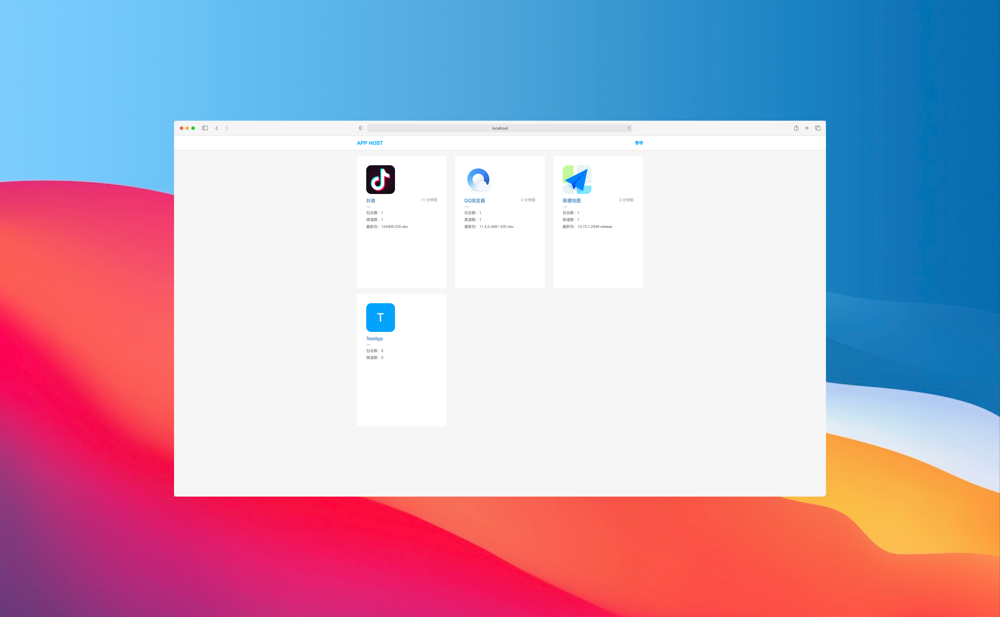
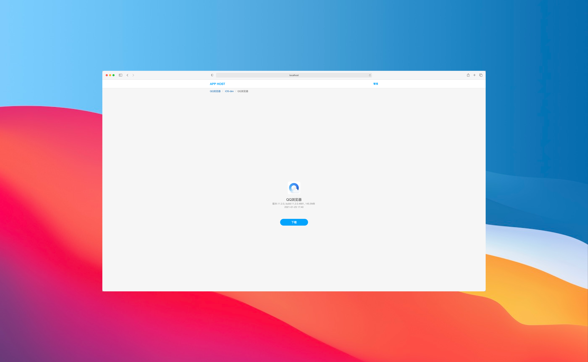
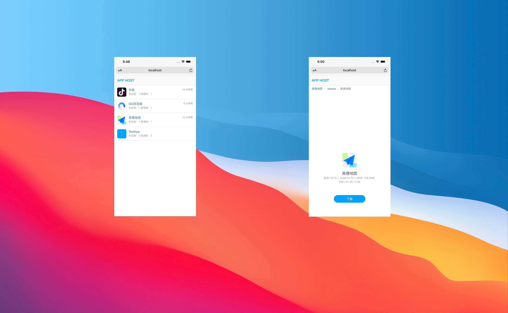

# AppHost


[](https://travis-ci.org/pluosi/app-host)
[](https://travis-ci.org/pluosi/app-host)
[]()

## Introduce (介绍)
A lightweight app package host server for iOS and Android. Like fir.im, can deploy in intranet of your company. It's open source and very easily for you to develop on your own requirements.
一个轻量级的包托管网站，app-host 主要用于 iOS 和 Android 的包管理，作用类似于fir.im，不同之处是可以自由部署在内网，方便了公司项目保密。并且代码开源也可以方便根据各自需求进行定制化开发。

## Features 目前的功能
1.New App 新建包<br>
2.New Plat 包底下新建渠道（ iOS，安卓，各种环境都归为渠道，例如 iOS 生产，iOS 沙盒，iOS 越狱版，Android 生产等）<br>
3.Upload ipa/apk/aab on plat page 渠道下面上传包<br>
4.Upload ipa/apk/aab by api 
4.account and permission management 帐号和权限管理<br>
6.analyze ipa/apk infos 解析包信息，包括 iOS 的包类型 ADHOC 还是 release，udid，安卓的签名证书等<br>


## Recommend Usage: Use Docker Image on hub.docker.com
```
1. docker run --name app_host -v ~/shared:/app/shared -p 3000:8686 -d kumali/app-host:latest
```

## build docker image by your own
```
1. > git clone https://github.com/EFEducationFirst/app-host.git /opt/app-host
2. > cd /opt/app-host
5. > ./docker/launcher bootstrap -v #depends on network status, if you are in bad network, just retry it.
6. > ./docker/launcher start
7. visit http://localhost:3000 , you can change `local_port` in docker/launcher
ps:db and upload files will be all in shared directory
```

## develop at local
0. > brew install rbenv
1. > rbenv install 2.5.1
2. write init script to your .bashrc or .zshrc
```sh
# setting rbenv
if command -v rbenv 1>/dev/null 2>&1; then
  eval "$(rbenv init -)"
  eval "$(rbenv global 2.5.1)"
fi
```
3. source config files
>source ~/.bashrc
or
>source ~/.zshrc
4. > rbenv rehash
5. > gem install bundler -v '1.16.1'
6. > git clone https://github.com/EFEducationFirst/app-host.git
7. > cd app-host
8. > bundle install
  // if you get the error msg of install libv8, please use the commands under list
  - > gem install libv8 -v '3.16.14.19' -- --with-system-v8
  - > brew install v8-315
  - > gem install therubyracer -v '0.12.3' -- --with-v8-dir='/usr/local/opt/v8@3.15'
9. > gem install rails
10. > rbenv rehash
// refresh cache of rbenv，otherwise the terminal can't find rails
11. > rake db:migrate RAILS_ENV=development 
// generate db
10. > rails s
// run dev mode
11. if you want deploy it to production, please read the docs of rails puma，need to change deploy address in config/deply.rb
12. change secret_key_base for production in config/secrets.yml, you can get it by run `rake secret`
12. visit http://localhost:3000
```

2. nginx config of passby docker container nginx service
```sh
upstream apphost {
    server localhost:3000;
}

server {
    listen      80;
    server_name apphost.example.com;
    return 301 https://$http_host$request_uri;
}

server {
    server_name apphost.example.com;

    client_max_body_size 500M;

    location / {
       proxy_redirect off;
       proxy_set_header Host $http_host;
       proxy_set_header X-Real-IP $remote_addr;
       proxy_set_header X-Forwarded-For $proxy_add_x_forwarded_for;
       proxy_set_header X-Forwarded-Proto $scheme;
       proxy_pass http://apphost;
    }

    listen 443 ssl; # managed by Certbot
    ssl_certificate /etc/letsencrypt/live/apphost.example.com/fullchain.pem; # managed by Certbot
    ssl_certificate_key /etc/letsencrypt/live/apphost.example.com/privkey.pem; # managed by Certbot
    include /etc/letsencrypt/options-ssl-nginx.conf; # managed by Certbot
    ssl_dhparam /etc/letsencrypt/ssl-dhparams.pem; # managed by Certbot
}
```
docker start command
```sh
docker run -d --name app_host -h app_host -v /opt/app-host-data:/app/shared -p 3000:8686 kumali/app-host:latest
```
## known issues
1. if the logo of apk is not an image，can't show logo，cause we haven't analyze logo in xml
2. user can delete upload files
3. can't analyze aab package


## License
AppHost is released under the MIT license. See LICENSE for details.


## preview







 
